Kimono Designer
============

Kimono Designer allows a developer to graphically edit SkiaSharp based graphic objects that can be converted to code and included in any cross-platform language and OS that SkiaSharp supports.

## Key Features

Kimono Designer provides several key features that make it the perfect tool for designing SkiaSharp graphics that can be used in all of your cross-platform applications.

### Groups with Boolean Operations and Masks

Multiple shapes can be grouped together and features such as boolean operations and masks can be applied to the items in the group. When applying a mask, the top-most item in the group will be used as the masking path:

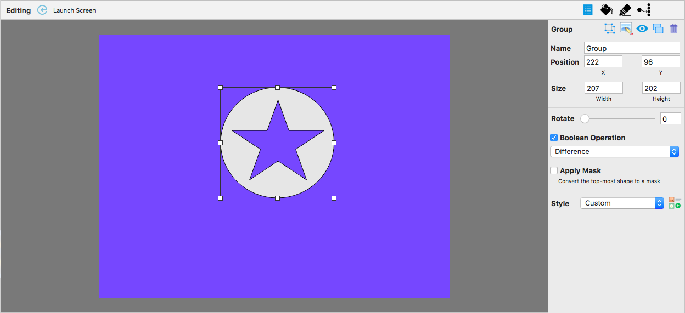

### Named Palette Colors

A series of named colors can be defined and used in gradients, named styles, by shapes directly or as the basis of other named colors. If a named color is adjusted, everything using the named color will be updated to reflect the new value:

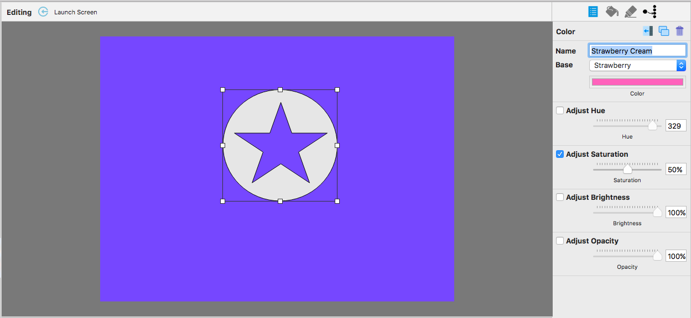

### Visual Gradient Editor

Build named gradients that can be used in named styles or in shapes directly using the built-in gradient editor. Any changes to a gradient will instantly be reflected in the sketch:

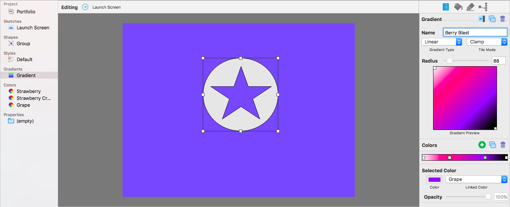

### Named Styles

A series of named styles can be created and applied to several shapes in any sketch in a portfolio to provide a uniform look. Any change in a named style will instantly be reflected in the sketch:

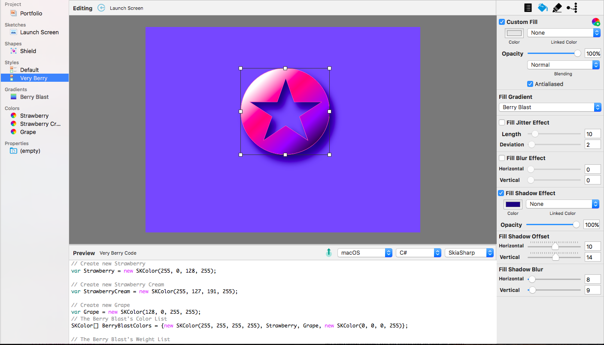

### Multiple Sketches within a Portfolio

Multiple sketches can be created inside the same portfolio and all of the named colors, gradients and named styles can be applied across sketches. Additionally, the user has control over how an individual sketch will be exported to source code:

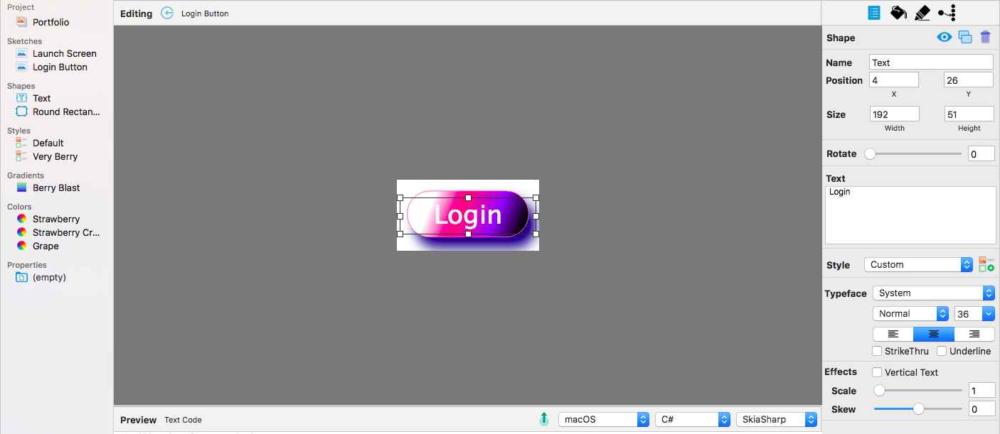

### Portfolios

Portfolios can contain multiple named colors, gradients, styles and sketches that can be exported to source code as a single class:

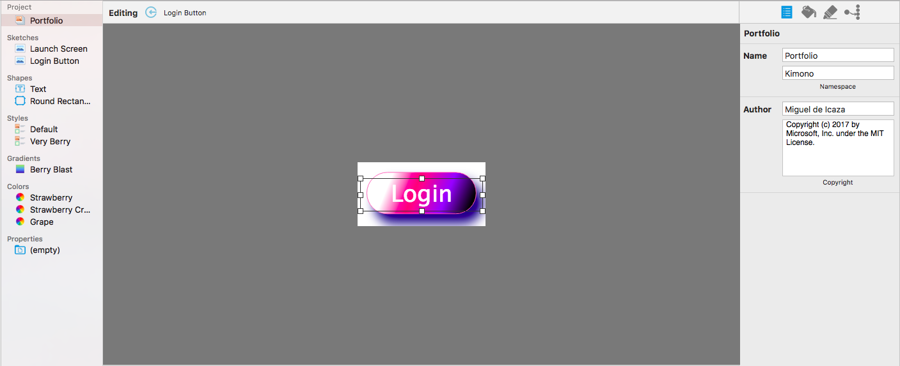

When this class is included in a cross-platform application, the developer can use its properties and methods to adjust graphics properties and draw the individual sketches:

### Linked Properties

The user can define several different types of named properties in a portfolio and attach those properties to values for colors, gradients, styles and shapes. Use the Portfolio menu to define a new property of a given type. Next, configure the new property in the Property Inspector:

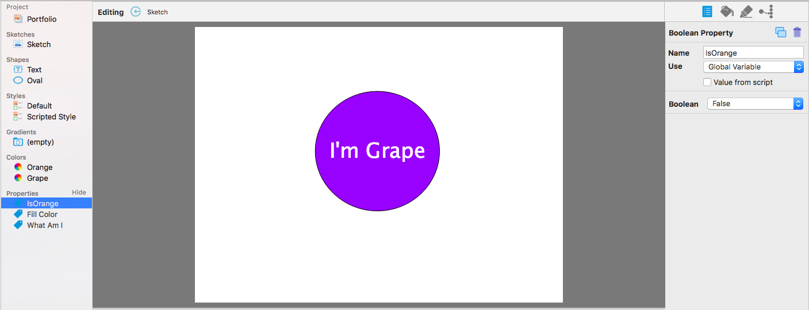

After the property has been defined, select a color, gradient, style or shape, switch to the Connection Inspector and attach the property to the desired value of the selected item:

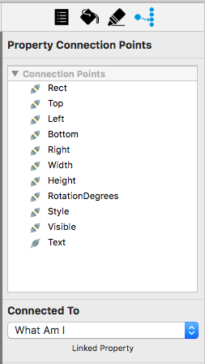

When the value of the property changes, any item in the sketch using the property will be instantly updated with the new value:

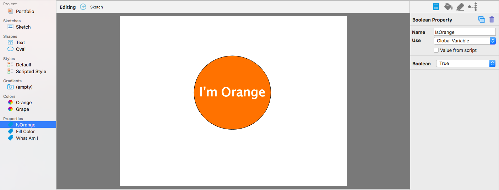

The following property types can be defined:

* **Boolean** - Holds a `true` or `false` value.
* **Number** - Holds a numeric value.
* **Text** - Holds a string value.
* **Rect** - Holds a rectangular value.
* **Color** - Returns a named color stored in the portfolio.
* **Gradient** - Returns a named gradient stored in the portfolio.
* **Style** -Returns a named style stored in the portfolio.

In addition to being constant values, properties can derive their values from an attached ObiScript (see ObiScript section below) and dynamically change based on the state of other properties or user interaction.

> ⚠️ WARNING:
> 
> In the current version of Kimono Designer, Linked Properties will be flattened to their current values when source code is generated or exported. To maintain mutable properties, use the **KimonoCore Support Library** when exporting code (see below for more details).

## Source Code Generation

The main purpose of the Kimono Designer is to allow the developer to graphically define SkiaSharp objects that will be converted to source code that can be used in any cross-platform application that supports SkiaSharp.

As the sketch is designed and edited on the Kimono Designer design surface, source code will be generated for the requested operating system, language and support library in the code preview area:

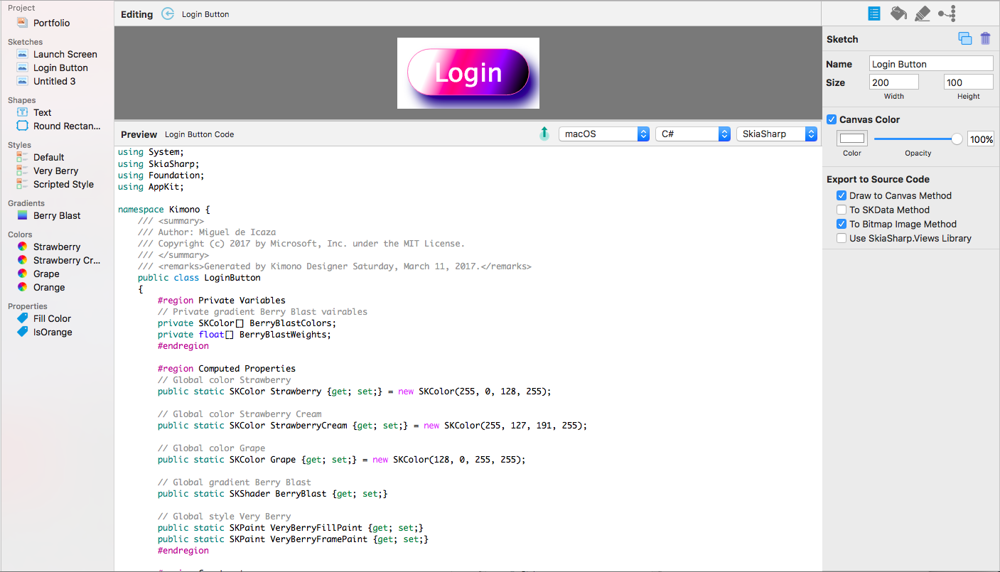

### Code Snippets

Based on what is selected, code snippets will be generated for individual colors, gradients, styles, shapes and shape groups. These snippets can be copied from the preview area and pasted into Visual Studio projects:

### Generate Code for Multiple Platforms

Source code can be generated for multiple OS platforms with support for Xamarin.Forms (cross-platform) and SkiaSharp.Views (set at the Sketch level):

### Use KimonoCore Support Library

Source code can either be generated directly using SkiaSharp classes or by using the KimonoCore helper classes, which produces smaller source code files and provides several useful features (such as mutable linked properties and ObiScript functionality):

When using the helper classes, the developer will need to include the KimonoCore library in any project that consumes the code.

## ObiScript

As stated above, portfolio properties can derive their values by executing an attached script written in the ObiScript language. ObiScript is a powerful and easy scripting language built on top of the [DScript](https://github.com/bizzehdee/DScript) language (by Darren Horrocks). Because of this, ObiScript's syntax is nearly identical to JavaScript:

When developing or editing an ObiScript, the user can instantly test the script using the Debugging Inspector:

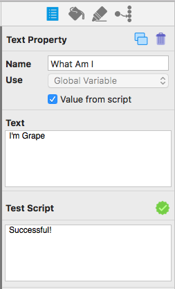

In the event of an error, the Debugger Inspector will give helpful error messages:

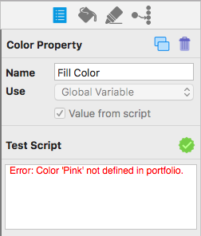

In addition to all of the standard language features that JavaScript provides, ObiScript provides the following:

### Return Functions

* `Return.Text` - Returns a string value to the property.
* `Return.Boolean` - Returns a boolean value to the property.
* `Return.Color` - Returns a named color to the property.
* `Return.Gradient` - Returns a named gradient to the property.
* `Return.NoGradient` - Removes the gradient from the property.
* `Return.Style` - Returns a named style to the property.
* `Return.NoStyle` - Removes the style from the property.
* `Return.Property` - Returns the value of another property to the property.
* `Return.Rect` - Returns a rectangular value to the property.
* `Return.RaiseError` - Raises an error message in the Kimono Designer.
* `Return.ClearResults` - Erases the results of the last ObiScript executed.

### Portfolio Functions

* `Portfolio.GetBoolean` - Gets the value of a boolean property.
* `Portfolio.SetBoolean` - Sets the value of a boolean property.
* `Portfolio.GetNumber` - Gets the value of a numeric property.
* `Portfolio.SetNumber` - Sets the value of a numeric property.
* `Portfolio.GetText` - Gets the value of a text property.
* `Portfolio.SetText` - Sets the value of a text property.
* `Portfolio.SetRect` - Sets the value of a rect property.
* `Portfolio.SetColor` - Sets the RGBa value of a color property.
* `Portfolio.SetNamedColor` - Sets the RGBa value of a named color in the portfolio.
* `Portfolio.HasColor` - Returns `true` if the portfolio contains the given named color.
* `Portfolio.HasGradient` - Returns `true` if the portfolio contains the given gradient.
* `Portfolio.HasStyle` - Returns `true` if the portfolio contains the given style.
* `Portfolio.HasProperty` - Returns `true` if the portfolio contains the given property.

### Console Functions

* `Console.WriteLine` - Writes the given string to the Visual Studio output pane and performs a newline.
* `Console.Write` - Writes the given string to the Visual Studio output.

### Conversion Functions

* `Convert.IntToString`
* `Convert.FloatToString`
* `Convert.FloatToInt`
* `Convert.StringToFloat`
* `Convert.StringToInt`

### Random Number Functions

* `Random.Next`
* `Random.NextMax`
* `Random.NextMinMax`

### Math Functions

* `Math.Pi`
* `Math.E`
* `Math.Abs`
* `Math.Round`
* `Math.Ceil`
* `Math.Floor`
* `Math.Min`
* `Math.Max`
* `Math.Range`
* `Math.Sign`
* `Math.Sin`
* `Math.Cos`
* `Math.Tan`
* `Math.Sinh`
* `Math.Cosh`
* `Math.Tanh`
* `Math.ASin`
* `Math.ACos`
* `Math.ATan`
* `Math.ASinh`
* `Math.ACosh`
* `Math.ATan2`
* `Math.Pow`
* `Math.Sqrt`
* `Math.Log`
* `Math.Log10`
* `Math.Exp`

### Script Libraries

If the user has a group of ObiScript functions that they want to use across all of the scripts in the portfolio, they can add a **Script Library** from the **Portfolio** menu. Unlike a typical property, a Script Library holds a collection of `function` definitions: 

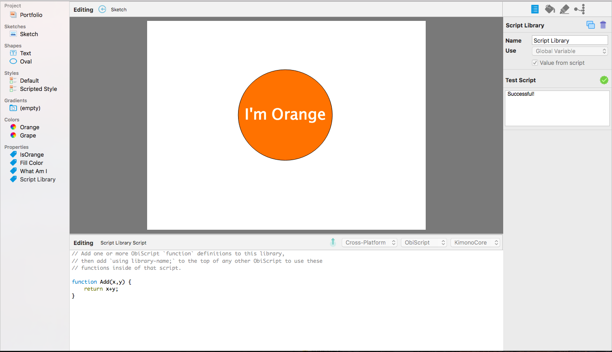

Any script that wants to use the functions in the library will need to add a `using library-name;` statement to the top of the script:

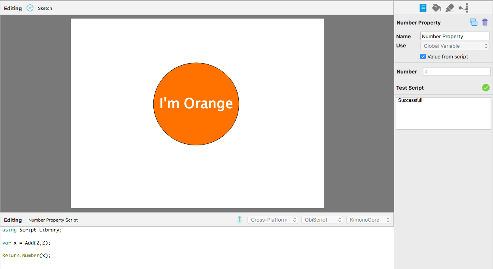

With that line in place, the user can call any function from the library as if it was defined inside the current script.

> ⚠️ WARNING:
> 
> In the current version of Kimono Designer, Linked Properties and ObiScripts will be flattened to their current values when source code is generated or exported. To maintain mutable properties and ObiScripts, use the **KimonoCore Support Library** when exporting code (see above for more details).

## Work in Progress

This app is very much a work-in-progress and still has several rough areas and missing features (such as copy & paste). Up to this point, work has been focused on getting the core functionality in place, so there are also areas where the User Interface needs to be refined and polished. For now, the app is definitely use at your own risk!

While the editor is currently implemented in Xamarin.Mac and only runs on macOS, the project was designed to be built cross-platform. As such, most of the editor code has been implemented in the back end KimonoCore library and platform specific versions of the core libraries have already been built.

It is hoped that the front end Kimono Designer will be ported to other platforms such as Windows UWP, iOS for iPad and for Android Tables.

## About this Project

Kimono Designer and the KimonoCore libraries were created by Microsoft, Inc. and released under the MIT License. The design of the TextBase ORM is based off of [Sqlite.Net](https://github.com/praeclarum/sqlite-net) by Krueger Systems, Inc.

The code has been fully commented and, where available, links have be provided from key technologies or methods to relevant information in the [Xamarin.Mac Guides Documentation](https://developer.xamarin.com/guides/#mac).

### API Documentation

Full API documentation is provided via a **ReadMe** file in project folder for each Visual Studio project that makes up the Kimono Designer solution.

## Icon Resources

All of the icons were provided by [Icons8](https://icons8.com). The icons are free for personal use and also free for commercial use, but they require [linking](https://icons8.com/license/) to to their web site. They distribute them under the license called [Creative Commons Attribution-NoDerivs 3.0 Unported](https://creativecommons.org/licenses/by-nd/3.0/). Alternatively, you can [buy a license](https://icons8.com/paid-license-99/) that doesn't require any linking.

# License

**Kimono Designer**

Copyright (c) Microsoft Corporation

All rights reserved. 

MIT License

Permission is hereby granted, free of charge, to any person obtaining a 
copy of this software and associated documentation files (the "Software"), 
to deal in the Software without restriction, including without limitation 
the rights to use, copy, modify, merge, publish, distribute, sublicense, 
and/or sell copies of the Software, and to permit persons to whom the 
Software is furnished to do so, subject to the following conditions:

The above copyright notice and this permission notice shall be included 
in all copies or substantial portions of the Software.

THE SOFTWARE IS PROVIDED "AS IS", WITHOUT WARRANTY OF ANY KIND, EXPRESS 
OR IMPLIED, INCLUDING BUT NOT LIMITED TO THE WARRANTIES OF MERCHANTABILITY, 
FITNESS FOR A PARTICULAR PURPOSE AND NONINFRINGEMENT. IN NO EVENT SHALL 
THE AUTHORS OR COPYRIGHT HOLDERS BE LIABLE FOR ANY CLAIM, DAMAGES OR 
OTHER LIABILITY, WHETHER IN AN ACTION OF CONTRACT, TORT OR OTHERWISE, 
ARISING FROM, OUT OF OR IN CONNECTION WITH THE SOFTWARE OR THE USE OR 
OTHER DEALINGS IN THE SOFTWARE.
